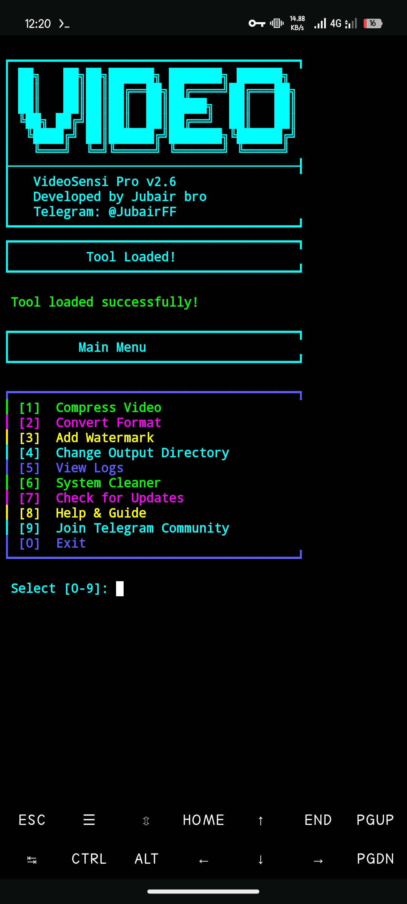
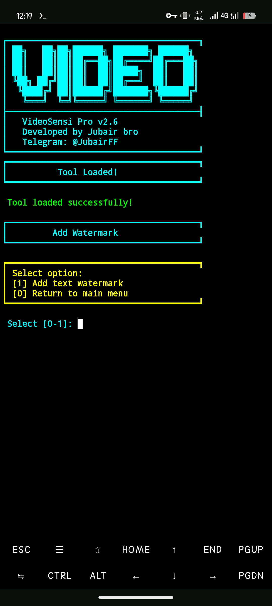
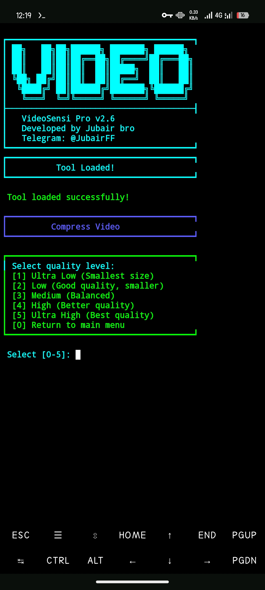

# VideoSensi pro 🔥

Welcome to VideoSensi! Your Termux video tool.  
Compress videos to save space.  
Add cool watermarks easily.  
Convert videos to any format.  
Colorful menu, super simple!  
By Jubair Bro.

## Setup
Run in Termux to start!  
- Install: `bash <(curl -s https://raw.githubusercontent.com/jubairbro/VideoSensi/main/setup.sh)`  
- Run: `videosensi`

## Screenshots
  

VideoSensi’s cool interface makes it fun! Pick options to compress, watermark, or convert videos in seconds.

## What Can You Do?
Make videos awesome in seconds!  
| Feature      | What it does           |
|--------------|------------------------|
| Compress     | Shrink videos fast    |
| Watermark    | Slap text on videos   |
| Convert      | Switch video formats  |

## About
Crafted by Jubair Bro 💪  
Join us: [Facebook Group](https://facebook.com/groups/tutorialzonebd/) | [Telegram](t.me/JubairFF)  
License: MIT (see [LICENSE](LICENSE) file)  
Made with 💖 for Termux fans!
